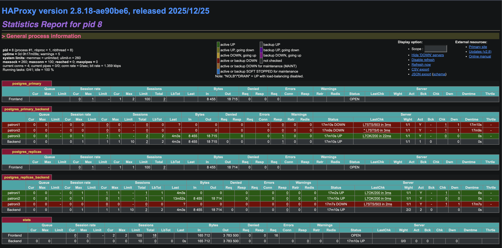
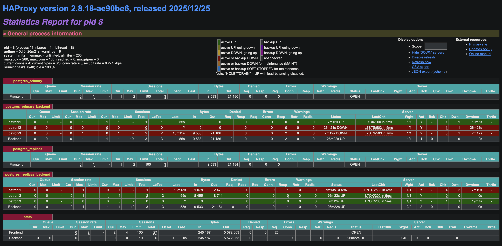

# PostgreSQL High Availability with Patroni, HAProxy & EF Core

## Architecture Overview

```
                         ┌──────────────────────────────────────────┐
                         │         etcd cluster (3 nodes)           │
                         │  etcd1 : etcd2 : etcd3  (port 2379/2380) │
                         │      Raft consensus / leader election    │
                         └───────────┬──────────────────────────────┘
                                     │ ↕ heartbeat & lock
              ┌──────────────────────┼───────────────────────┐
              │                      │                       │
   ┌──────────▼──────────┐ ┌─────────▼───────────┐ ┌─────────▼───────────┐
   │  patroni1 (Spilo)   │ │  patroni2 (Spilo)   │ │  patroni3 (Spilo)   │
   │  PostgreSQL :5432   │ │  PostgreSQL :5432   │ │  PostgreSQL :5432   │
   │  REST API    :8008  │ │  REST API    :8008  │ │  REST API    :8008  │
   │  (primary or repl)  │ │  (replica)          │ │  (replica)          │
   └─────────────────────┘ └─────────────────────┘ └─────────────────────┘
              │                      │                       │
              └──────────────────────┼───────────────────────┘
                                     │
                          ┌──────────▼──────────┐
                          │       HAProxy       │
                          │  :5000 → primary    │  GET /primary  → 200 on leader only
                          │  :5001 → replicas   │  GET /replica  → 200 on replicas only
                          │  :8404 → stats UI   │      round-robin across healthy replicas
                          └──────────┬──────────┘
                                     │
                          ┌──────────▼───────────┐
                          │    ASP.NET Core      │
                          │  WriteDb → :5000     │
                          │  ReadDb  → :5001     │
                          └──────────────────────┘
```

---

## What Is Implemented

| Component                  | Detail                                                                                                                                                   |
|----------------------------|----------------------------------------------------------------------------------------------------------------------------------------------------------|
| **etcd cluster**           | 3-node etcd (v3.5) for Patroni leader election via Raft consensus                                                                                        |
| **Patroni cluster**        | 3 Spilo nodes (Patroni + PostgreSQL 17 + WAL-G), automatic primary election & failover                                                                   |
| **post_init_wrapper.sh**   | Runs Spilo's original `post_init.sh` first, then creates `app_user` + `app_db` (similar to `POSTGRES_DB`/`POSTGRES_USER` in the official postgres image) |
| **HAProxy**                | Single HAProxy instance; port 5000 → primary (write), port 5001 → replicas (read, round-robin), port 8404 → stats UI                                     |
| **Health checks**          | HAProxy uses Patroni REST API (`GET /primary`, `GET /replica`) over HTTP on port 8008 while PostgreSQL traffic stays TCP                                 |
| **ASP.NET Core + EF Core** | Two `DbContext`s — `ApplicationWriteDbContext` (→ HAProxy :5000) and `ApplicationReadDbContext` (→ HAProxy :5001)                                        |

---

## How to Run

```bash
docker compose up -d

# Patroni cluster status
# Note: no -c flag needed — Spilo pre-sets PATRONICTL_CONFIG_FILE env var inside the container
docker exec -it patroni1 patronictl list

# HAProxy stats (browser) — credentials: haproxy / haproxy
open http://localhost:8404
```

---

## Demo Scenarios

### 1. 🔀 Manual Switchover ✅

A **switchover** is a graceful handover — the primary finishes in-flight transactions before stepping down.
Use `failover` only when the primary is already dead.

> **Note:** This repo sets stable Patroni member names via `PATRONI_NAME` (`patroni1`, `patroni2`, `patroni3`),
> so `--leader` should use the `Member` value from `patronictl list` (for example `patroni1`).
> `--master` was deprecated in Patroni v3.x.

```bash
# 1. Check current cluster state — note the Member name of the Leader
docker exec -it patroni1 patronictl list

# 2. Switchover — replace <leader-member-name> with the Member name from step 1
#    Omit --candidate to let Patroni pick the most up-to-date replica automatically
docker exec -it patroni1 patronictl switchover \
  --leader <leader-member-name> \
  --scheduled now \
  --force

# 3. Verify the new primary
docker exec -it patroni1 patronictl list
```

**Terminal output:**

```
hoc.nguyen@MBAM0187 % docker exec -it patroni1 patronictl list
+ Cluster: postgres-ha (7609605213415538750) -----+----+-----------+
| Member       | Host       | Role    | State     | TL | Lag in MB |
+--------------+------------+---------+-----------+----+-----------+
| 8366a0cc9c0b | 172.21.0.5 | Leader  | running   |  6 |           |
| a83e997af22c | 172.21.0.6 | Replica | streaming |  6 |         0 |
| da0b3dc3cce5 | 172.21.0.7 | Replica | streaming |  6 |         0 |
+--------------+------------+---------+-----------+----+-----------+

hoc.nguyen@MBAM0187 % docker exec -it patroni1 patronictl switchover \
  --leader 8366a0cc9c0b \
  --scheduled now \
  --force
Current cluster topology
+ Cluster: postgres-ha (7609605213415538750) -----+----+-----------+
| Member       | Host       | Role    | State     | TL | Lag in MB |
+--------------+------------+---------+-----------+----+-----------+
| 8366a0cc9c0b | 172.21.0.5 | Leader  | running   |  6 |           |
| a83e997af22c | 172.21.0.6 | Replica | streaming |  6 |         0 |
| da0b3dc3cce5 | 172.21.0.7 | Replica | streaming |  6 |         0 |
+--------------+------------+---------+-----------+----+-----------+
2026-02-28 07:41:29.48608 Successfully switched over to "da0b3dc3cce5"
+ Cluster: postgres-ha (7609605213415538750) ---+----+-----------+
| Member       | Host       | Role    | State   | TL | Lag in MB |
+--------------+------------+---------+---------+----+-----------+
| 8366a0cc9c0b | 172.21.0.5 | Replica | stopped |    |   unknown |
| a83e997af22c | 172.21.0.6 | Replica | running |  6 |         0 |
| da0b3dc3cce5 | 172.21.0.7 | Leader  | running |  7 |           |
+--------------+------------+---------+---------+----+-----------+

hoc.nguyen@MBAM0187 % docker exec -it patroni1 patronictl list
+ Cluster: postgres-ha (7609605213415538750) -----+----+-----------+
| Member       | Host       | Role    | State     | TL | Lag in MB |
+--------------+------------+---------+-----------+----+-----------+
| 8366a0cc9c0b | 172.21.0.5 | Replica | streaming |  7 |         0 |
| a83e997af22c | 172.21.0.6 | Replica | streaming |  7 |         0 |
| da0b3dc3cce5 | 172.21.0.7 | Leader  | running   |  7 |           |
+--------------+------------+---------+-----------+----+-----------+
```

**HAProxy stats — before & after:**



> **Before** — Leader: `patroni3` (`8366a0cc9c0b`) · `patroni1` & `patroni2` are replicas



> **After** — Leader: `patroni1` (`da0b3dc3cce5`) · `patroni2` & `patroni3` are replicas

---

### 2. 💥 Automatic Failover (kill the primary) ✅

```bash
chmod +x scripts/demo_auto_failover.sh scripts/check_replica_stuck.sh

# one-shot demo: kill leader -> auto failover -> write check -> rejoin check
bash scripts/demo_auto_failover.sh

# optional: skip HTTP write check when app API on :5050 is not running
SKIP_WRITE_CHECK=1 bash scripts/demo_auto_failover.sh
```

**What to observe**
- Patroni elects leader mới trong cửa sổ TTL (`ttl: 30`).
- Write qua HAProxy `:5000` vẫn chạy được sau failover.
- Node cũ khi rejoin có thể tạm thời `State=running`, `Lag in MB=1~2`, sau đó về `streaming`, lag `0`.

**Quick diagnosis script (khi nghi replica bị kẹt)**

```bash
# diagnose one replica member (default: patroni1)
bash scripts/check_replica_stuck.sh patroni1
```

**Recovery when truly stuck (>60s không vào `streaming`)**

```bash
# Reinit đúng 1 member bị kẹt (không restart cả cluster)
# chạy từ bất kỳ Patroni node nào còn sống (ví dụ patroni2)
docker exec <any-running-patroni-node> patronictl reinit postgres-ha <stuck-member-name> --force
docker exec <any-running-patroni-node> patronictl list
```

**Read-path note**
- Cluster 3 node (1 primary + 2 replica) vẫn đảm bảo write HA.
- Read HA có thể giảm tạm thời khi failover vì còn 1 replica sống phải catch-up timeline trước.

**Self-healing options đang bật trong repo**
- `remove_data_directory_on_rewind_failure: true`: nếu `pg_rewind` fail, Patroni xóa local `PGDATA` và clone lại từ leader.
- `remove_data_directory_on_diverged_timelines: true`: nếu diverged timeline không replay an toàn được, Patroni xóa `PGDATA` và base backup lại.
- Trade-off: tốn thời gian/IO hơn lúc recovery, đổi lại tránh trạng thái lag kẹt kéo dài.

### 3. ⚖️ Read Load Balancing ✅

`GET /products` returns `servedByNode` — the IP of the PostgreSQL node that actually served the query (via `inet_server_addr()`).

After posting a few products and calling `GET /products` repeatedly, HAProxy round-robin distributed read queries across replicas:

- First few requests → served by **patroni3**
- Subsequent requests → served by **patroni2**

This confirms that:
1. WAL streaming replication is working — replicas have up-to-date data written to the primary
2. HAProxy round-robin across healthy replicas is working — `servedByNode` IP changes across requests
3. `ApplicationReadDbContext` is correctly connecting through HAProxy `:5001`

```bash
# Write a product
curl -X POST https://localhost:7134/products \
  -H "Content-Type: application/json" \
  -d '{"name": "Apple", "price": 1.99}'

# Read products repeatedly — observe servedByNode changing between replica IPs
curl https://localhost:7134/products
curl https://localhost:7134/products
curl https://localhost:7134/products
```

- [x] Demonstrate **read-your-writes** edge case via `/products/read-your-writes-demo`

```bash
# Write to primary, then immediately read from replica and primary for the same product ID
curl -X POST https://localhost:7134/products/read-your-writes-demo \
  -H "Content-Type: application/json" \
  -d '{"name": "RYW demo", "price": 2.49}'
```

### 4. 🗄️ EF Core Migrations & CRUD Endpoints ✅

**Entity:** `Product` — uses a **factory pattern** (`Product.Create(...)`) with private setters to prevent invalid state. EF Core materializes it via a private parameterless constructor.

```csharp
// Product.Create() — the only valid way to create a Product
Product.Create(name: "Apple", price: 1.99m, createdAtUtc: DateTimeOffset.UtcNow)
```

**Write vs Read `IEntityTypeConfiguration`:**
- `ProductWriteConfiguration` — full DDL constraints: `HasMaxLength`, `HasColumnType`, `IsRequired`, `UseIdentityByDefaultColumn`. These drive migration-generated SQL.
- `ProductReadConfiguration` — minimal: only `HasKey`. No DDL constraints needed since the Read context never runs migrations.
- `ApplicationReadDbContext` registers with `UseQueryTrackingBehavior(NoTracking)` — no change tracking overhead for read-only queries.

**Migration** is applied automatically on startup via `writeDb.Database.MigrateAsync()` — runs only against the write DB (`:5000` → primary). Schema propagates to replicas automatically via WAL streaming replication.

```bash
# Add a new migration manually (if needed)
dotnet ef migrations add <Name> --context ApplicationWriteDbContext --output-dir Data/Migrations
```

**Endpoints:**

| Method | Path | DbContext | Routes to |
|---|---|---|---|
| `POST` | `/products` | `ApplicationWriteDbContext` | HAProxy `:5000` → primary |
| `POST` | `/products/read-your-writes-demo` | `ApplicationWriteDbContext` + `ApplicationReadDbContext` | write to primary (`:5000`), then immediate read from replica (`:5001`) and primary (`:5000`) |
| `GET` | `/products` | `ApplicationReadDbContext` | HAProxy `:5001` → replicas (round-robin) |

### 🔒 Security — Non-superuser App User

- [ ] Verify the app never uses the `postgres` superuser — `app_user` should only have `CONNECT` + `USAGE` + DML on `app_db` (follows [Patroni docs recommendation](https://patroni.readthedocs.io/en/latest/security.html))
- [ ] Add explicit `GRANT` statements in `post_init_wrapper.sh` scoped to specific schemas/tables

### 🐛 Observability & Debugging

- [x] ✅ **HAProxy stats page** (`:8404`) — walk through important columns to understand backend health and load distribution:

  

  **Queue** — `Cur / Max / Limit`
  - Number of requests currently waiting in queue because all backend connections are busy.
  - In a healthy low-traffic system this is always `0`. A non-zero `Cur` means the backend is saturated.

  **Sessions** — `Cur / Max / Limit / Total / LbTot / Last`
  - `Cur` — number of currently active sessions on this server.
  - `Max` — peak concurrent sessions since HAProxy started.
  - `Total` — cumulative sessions handled since HAProxy started.
  - `LbTot` — total times this server was selected by the load balancer (useful to verify round-robin is distributing evenly).
  - `Last` — time elapsed since the last session on this server (e.g. `55s`, `13m15s`). A very large value means the server hasn't received traffic recently.

  **Bytes** — `In / Out`
  - Total bytes received from clients (`In`) and sent to clients (`Out`) for this server since HAProxy started.
  - If one node has significantly higher values than others, it may indicate uneven load distribution or a hotspot.

  **Status**
  - The most important column. Shows the current health state of each backend server:
    - `UP` (green) — healthy, receiving traffic.
    - `DOWN` (red) — failed health checks, no traffic routed to this server.
    - `UP, going down` / `DOWN, going up` — transitional states during `fall`/`rise` threshold counting.

  **LastChk** — result of the most recent health check
  - `L7OK/200 in 3ms` — Layer 7 (HTTP) check succeeded, Patroni returned HTTP 200, took 3 ms.
  - `L7STS/503 in 5ms` — Layer 7 check failed, Patroni returned HTTP 503 (node is not primary/replica), took 5 ms. HAProxy counts this toward the `fall` threshold.
  - `* L7STS/0 in 3ms` — the `*` prefix means this result caused a state change (server just went DOWN or came back UP).

  **Wght** — load balancing weight
  - All servers with equal weight receive equal share of traffic (pure round-robin).
  - If weights differ, traffic is distributed proportionally.

  **Act / Bck**
  - `Act = Y` — server is configured as an **active** server (receives traffic under normal conditions).
  - `Bck = Y` — server is a **backup** server, only used when all active servers are down.
  - `-` means not applicable for that role.

  **Chk / Dwn / Dwntme**
  - `Chk` — number of consecutive failed health checks since the last state change. Once this reaches the `fall` threshold (configured as `fall 3`), the server is marked `DOWN`.
  - `Dwn` — total number of times this server has been marked `DOWN` since HAProxy started. A high number indicates instability or frequent flapping.
  - `Dwntme` — total accumulated downtime. Useful for measuring overall availability.


- [ ] **Patroni REST API** — `curl` directly against each node: `/primary`, `/replica`, `/health`, `/patroni`, `/cluster`
- [ ] **etcd inspection** — `etcdctl get --prefix /service/postgres-ha` to see the DCS keys Patroni writes (leader lock, member info, config)

### 7. 🌐 Connection Pooling

- [ ] Add **PgBouncer** between the app and HAProxy; compare connection count with and without pooling under load
- [ ] Show how **transaction-mode pooling** interacts with EF Core — session-level features (`SET LOCAL`, temp tables, advisory locks) won't work in this mode

### 8. 🏋️ Load Testing

- [ ] **k6 / pgbench** — concurrent read + write load; observe HAProxy stats, `pg_stat_activity`, replication lag in real time
- [ ] **Chaos test** — combine failover + load test; measure p99 latency and error rate during the election window

### 9. ☁️ Production Patterns (stretch goals)

- [ ] **WAL-G + MinIO** — configure S3-compatible backup, demo PITR (Point-In-Time Recovery)
- [ ] **HA HAProxy** — add a second HAProxy + Keepalived VIP to remove HAProxy as a single point of failure
- [ ] **Kubernetes** — migrate to k8s using the [Zalando Postgres Operator](https://github.com/zalando/postgres-operator)
